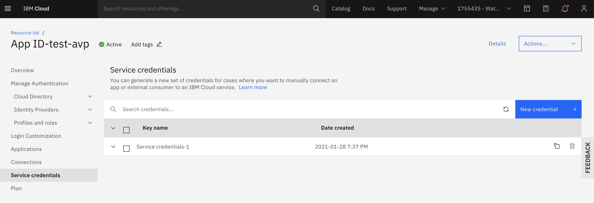

# Roteiro para configuração e instalação da aplicação

Depois de copiado os arquivos para a sua máquina, execute os seguintes comandos:

````
cd tutorial_appid
virtualenv venv
source venv/bin/activate
python -m pip install --upgrade pip
pip install -r requirements.txt
````

Preencha as variáveis de ambiente do arquivo `run_example.sh`. Se preferir, altere o nome do arquivo para `run.sh`. 

No arquivo `run_example.sh` você vai visualizar as seguintes variáveis: 

````
export OAUTH_SERVER_URL=
export CLIENT_ID=
export SECRET=
export REDIRECT_URI=
````

Os valores para estas variáveis são obtidos no serviço App ID, na aba de credenciais. Nesta aba você irá ver variáveis com exatamente estes nomes. É só copiar e colar para o arquivo `run_example.sh`. 



Para inicializar o servidor execute `./run.sh`. A qualquer momento você pode sair do `venv` digitando `deactivate`. E voltar a usar o ambiente virtual com `source venv/bin/activate`. 
